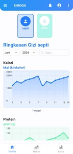
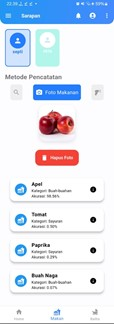
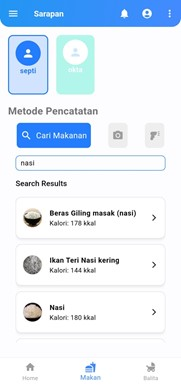

# SIMOGA: Aplikasi Monitoring Gizi Balita dan Pencatatan Makanan

  
_Logo aplikasi SIMOGA_

**SIMOGA** adalah aplikasi berbasis Android yang dirancang untuk membantu orang tua mencatat dan memantau asupan makanan balita secara detail. Dengan fitur pencatatan makanan yang komprehensif, aplikasi ini memudahkan orang tua untuk memastikan balita mendapatkan nutrisi yang seimbang dan mendukung tumbuh kembang optimal.

---

## Fitur Utama

- **Pencatatan Makanan Terperinci:**

  - Input makanan dengan detail porsi dan waktu makan
  - Kalkulasi otomatis kandungan nutrisi per makanan
  - Riwayat makanan harian, mingguan, dan bulanan
  - Kategorisasi makanan (sarapan, makan siang, makan malam, cemilan)
  - Pencatatan alergi dan reaksi makanan

    
  _Tampilan dashboard pencatatan makanan harian._

- **Analisis Asupan Nutrisi:**

  - Perhitungan total kalori harian
  - Pemantauan asupan protein, karbohidrat, dan lemak
  - Analisis vitamin dan mineral utama
  - Grafik tren konsumsi makanan
  - Perbandingan dengan standar AKG (Angka Kecukupan Gizi)

    
  _Analisis detail nutrisi dari makanan yang dicatat._

- **Manajemen Menu Makanan:**

  - Penyimpanan resep favorit
  - Daftar makanan yang sering dikonsumsi
  - Pengaturan jadwal makan
  - Pengingat waktu makan
  - Template menu mingguan

    
  _Fitur manajemen dan perencanaan menu makanan._

---

## Teknologi yang Digunakan

- **Framework:** Flutter (untuk pengembangan aplikasi Android)
- **Backend:** Firebase (untuk penyimpanan data makanan dan nutrisi)
- **Database:** Firebase Realtime Database (untuk pencatatan real-time)
- **API Nutrisi:** USDA Food Database API (untuk informasi kandungan gizi)

---

## Persyaratan Sistem

- **Platform:** Android 6.0 (Marshmallow) atau yang lebih baru
- **Spesifikasi Minimum:**
  - **RAM:** 2GB
  - **Penyimpanan:** 100MB ruang kosong
  - **Koneksi Internet:** Diperlukan untuk sinkronisasi data

---

## Instalasi

1. Clone repositori ini ke perangkat Anda:

   ```bash
   git clone https://github.com/username/simoga.git
   ```

2. Masuk ke direktori proyek:

   ```bash
   cd simoga
   ```

3. Instal dependensi yang diperlukan:

   ```bash
   flutter pub get
   ```

4. Konfigurasi Firebase:

   - Buat project Firebase di Firebase Console
   - Unduh file `google-services.json` untuk Android dan letakkan di folder `android/app/`

5. Jalankan aplikasi:
   ```bash
   flutter run
   ```

## Kontribusi

Kami membuka peluang kontribusi untuk meningkatkan sistem pencatatan makanan ini. Jika Anda memiliki saran atau menemukan masalah, silakan buat **issue** atau ajukan **pull request**.

## Lisensi

Aplikasi ini dilisensikan di bawah MIT License.

## Kontak

- **Nama:** Okta Maulana
- **Email:** oktamaulana12@gmail.com
- **Alamat:** Jl. Pertamina Km.4, Sintang, Kalimantan Barat
- **Nomor Telepon:** 081522716223
